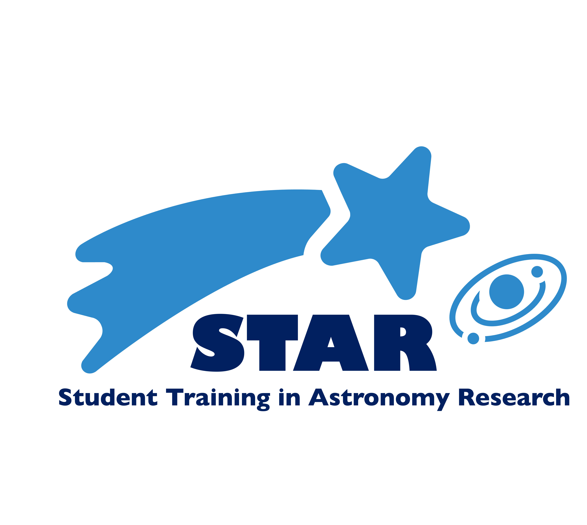



## Columbia Student Training in Astronomy Research (STAR) Mentoring Program

### Program Details: 
- September 2025 - May 2026. 
- Students meet 2x week for 2 hours with their research mentors. 
- STAR students are paid for their work! 
 

### Program Requirements:  
- No prior research experience needed—just interest + curiosity! 
- Applicants must be in 10th-12th grade during 2025-2026. 
- Currently partnered with Columbia Secondary School for 2025-2026 program. 
 

### Application are open May 26 – June 13, 2025. Link [here](https://forms.gle/bWBH8LMW5eBWbk7v8).

