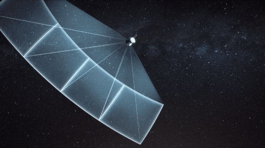



In between undergraduate and graduate school, I worked for two years as an astronomer at the Center for Astrophysics \| Harvard and Smithsonian (CfA) with Dr. David Latham. TESS, the Transiting Exoplanet Survey Satellite, is a NASA satellite that launched in April 2018. TESS searches for planets using the transit method. The transit method in exoplanet science is where we look for a periodic decrease in the light received from a distant star, due to the planet passing in front of the star relative to Earth. In working on TESS, I contributed to the science team in several ways and grew immensely as a researcher.​​  

**My work on the TESS Mission included:**  

- Group lead in the planet vetting process  -- for which I individually vetted light curves targeted as planet candidates by the analysis pipelines and led weekly group vetting sessions where we decided which targets to alert as planet candidates to the public.  

- I ran photometric follow-up observations (~20 nights) of TESS Objects of Interest (TOIs) using the 16” Clay Telescope at Harvard University to observe TOIs in the northern hemisphere. I also led outreach SG1 observing sessions (~10 nights) of TOIs with undergraduate students at the Clay Telescope as a part of the Harvard Observing Project.  

- I planned and ran spectroscopic follow-up observations of TOIs using TRES on the 1.5 m Tillinghast Reflector at FLWO on Mt. Hopkins, AZ.  

- I ran SPC analysis on TRES spectra of TESS planet candidate host stars to estimate the stellar temperature, metallicity, surface gravity, and rotation -- so that candidates for precise radial velocity observations by instruments like HARPS-N can be selected.

- I wrote an MCMC RV code, to help with the RV modeling of TRES spectroscopic observations.

