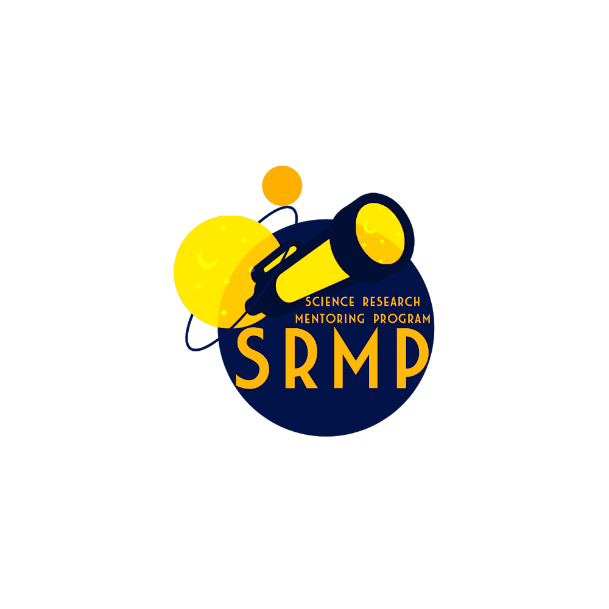
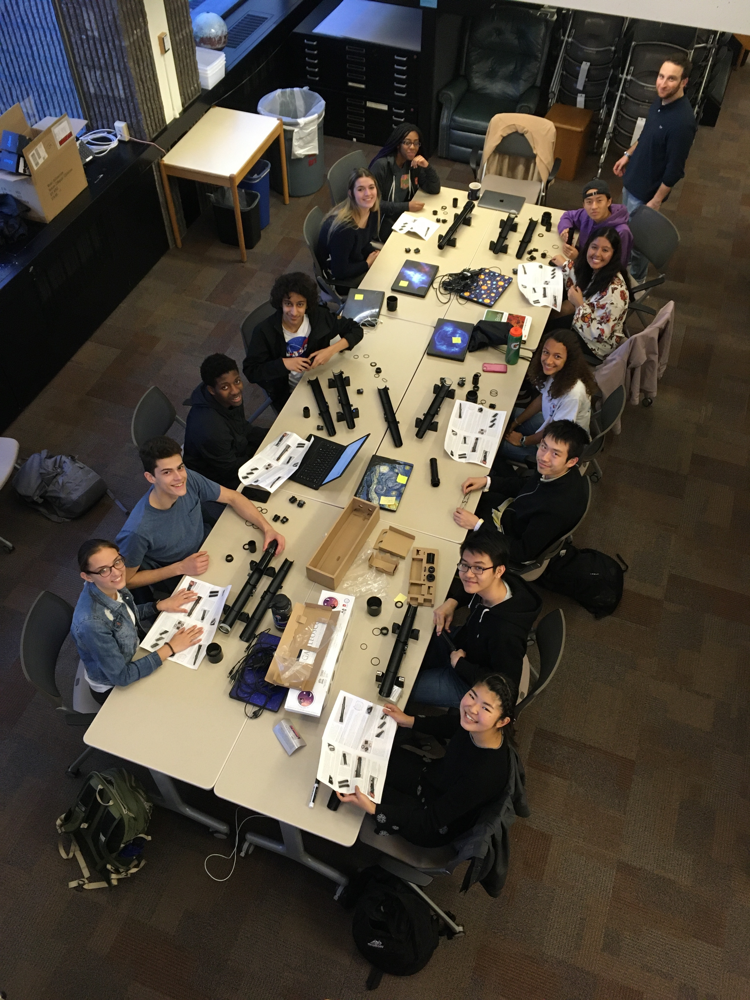



## Harvard Science Research Mentoring Program (SRMP)

I had tremendous mentors who encouraged me to pursue my interests in astronomy and astrophyiscs, and I believe that the best way to encourage students to follow their scientific curiosities is to provide them opportunities to and help guide them through conducting real research and show them that they can make meaningful contributions to scientific discovery. I also have become a better scientist through mentorship, as I learn through teaching and am reminded of the passion and deep interest that first brought me to astronomy.​  

I have been actively involved in the mentorship of high school research projects for students from underserved communities since 2018. The [Harvard SRMP](https://projects.iq.harvard.edu/shrimp/home) is a program in which 10-15 high school students from the public Cambridge Ridge and Latin School conduct research projects with scientists at the CfA and MIT.  

I have been lucky to serve in many roles in my time with the Harvard SRMP:  
- Co-Director of the program from 2020-2022
- Project Mentor (3 students studying exoplanet TTVs) from 2022-2023
- Project Mentor (3 students studying self-lensing binaries) from 2020-2021  
- Associate Director from 2020-2021
- Head of Observing from 2018-2020

  
  
  

## Mentorship
I'm passionate about mentorship at all levels of academia. I have multiple strong female mentors who have guided me throughout my studies, and I encourage women -- especially women of colour -- to surround themselves with people that appreciate your value.
