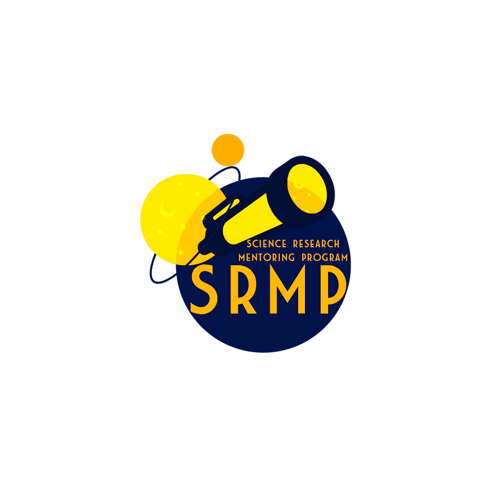
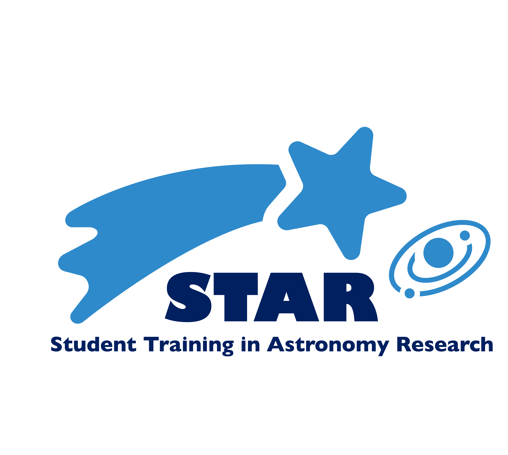
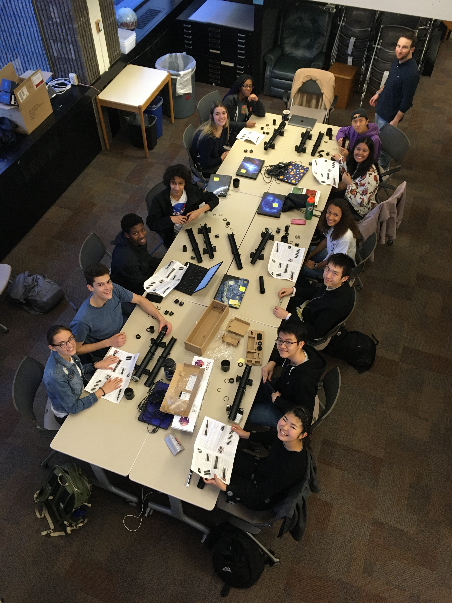



## High School Research Mentorship Programs
# Harvard-MIT Science Research Mentoring Program (SRMP)

Early on, I had tremendous mentors who encouraged me to pursue my interests in astronomy and astrophysics, and I believe that the best way to encourage students to follow their scientific curiosities is to provide them opportunities to conduct real research and to guide them through the process, showing them that they can make meaningful contributions to scientific discovery.   

Mentorship has also helped me become a better scientist. Through teaching and guiding students, I am continually reminded of the passion and curiosity that first drew me to astronomy.   

Since 2018, I have been actively involved in mentoring high school students in year-long research projects, particularly students from underserved communities. One of the central programs I have worked with is the Harvard–MIT Science Research Mentoring Program ([Harvard SRMP](https://projects.iq.harvard.edu/shrimp/home)), in which 10–15 students from the Cambridge Rindge and Latin School (the public high school in Cambridge, MA) conduct original research projects with scientists at the Center for Astrophysics and MIT.   

There are many ways to evaluate the success of such programs, and each has its limitations. Two outcomes that I find particularly encouraging are: (1) the number of applicants to the program grew from 16 to 46 students between 2020 and 2023, and (2) research by SRMP students has been recognized through co-authorship on refereed scientific papers in at least six cases.   

I have been fortunate to serve in several roles within the Harvard SRMP:  

- Co-Director of the program (2020–2022, 2026-Present)
- Project Mentor — Exoplanet Transit Timing Variations (3 students) (2022–2023)
- Project Mentor — Self-Lensing Binaries (3 students) (2020–2021)
- Associate Director (2020–2021)
- Head of Observing (2018–2020)   

# Columbia Student Training in Astronomy Research (STAR)

Building on my experience with SRMP, I founded the **Columbia Student Training in Astronomy Research (STAR) Program**, a year-long, paid mentorship initiative for students from a public high school in Harlem. During my Ph.D., I assembled a team of faculty, graduate students, postdocs, and program staff at Columbia and built partnerships with school leadership and external organizations to launch the program.   

The pilot cohort ran in the 2024–2025 academic year with 10 students conducting astronomy research projects. The program expanded to 12 students in 2025–2026, and a similar cohort is anticipated for 2026–2027. To support the program, I secured $55,000–$70,000 of external funding annually from the Pinkerton Foundation to provide stipends for both students and mentors and to sustain the program across multiple cohorts.   

I have served in several roles within the Columbia STAR Program:  

- Founder and Director (2024–2025)
- Advisory Director (2025-Present)
- Project Mentor (2024–2026)

  
  
  

