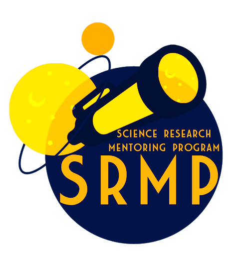



## Science Research Mentoring Program (SRMP)

Early on, I had tremendous mentors who encouraged me to pursue my interests in astronomy and astrophyiscs, and I believe that the best way to encourage students to follow their scientific curiosities is to provide them opportunities to and help guide them through conducting real research and show them that they can make meaningful contributions to scientific discovery.  

I have also become a better scientist through mentorship, as I learn through teaching and am reminded of the passion and deep interest that first brought me to astronomy.​  

I have been actively involved in the mentorship of high school research projects for students from underserved communities since 2018. The [Harvard SRMP](https://projects.iq.harvard.edu/shrimp/home) is a program in which 10-15 high school students from the public Cambridge Ridge and Latin School conduct research projects with scientists at the CfA and MIT.  

There are various ways to evaluate the success of such a program, and all inherantly have their own flaws. I am most excited and proud by two facts: (1) the number of applicants for the program grew from 16 students to 42 students from 2020 to 2023 and (2) research by students in the SRMP program has been recognized via co-authorship of refereed papers in (at least) 6 cases!

I am in the process of developing a similar program at Columbia, with an anticipate start in Fall 2024.  

I have been lucky to serve in many roles in my time with the Harvard SRMP:  
- Co-Director of the program from 2020-2022
- Project Mentor (3 students studying exoplanet TTVs) from 2022-2023
- Project Mentor (3 students studying self-lensing binaries) from 2020-2021  
- Associate Director from 2020-2021
- Head of Observing from 2018-2020

  
  
  

## Students Mentored

**As Primary Advisor**  
*Undergraduate Students:*  

Determining the Mass and Radius of the White Dwarfs in Four Kepler Self-Lensing Binaries, 2023 – . 
- Yassine Abaakil, Columbia University Undergraduate.

 
*High School Students (through Harvard SRMP):*  

Identifying Transit Timing Variations in Planetary Hierarchical Triples, 2022 – 2023. 
- Farai Sundai, CRLS 10th Grade.
- Jiajing Liu, CRLS 12th Grade, Currently a University of Minnesota Undergraduate.
- Lila Valaskovic, CRLS 12th Grade, Currently a Colgate Undergraduate.

 
Modeling the Radial Velocities of Four Kepler Self-Lensing Binaries, 2020 – 2021.
- Mohammed Sakib, CRLS 11th Grade. Currently a Harvard Undergraduate.
- Tsion Tedla, CRLS 12th Grade, Currently a Boston University Undergraduate.
- Victoria Chen, CRLS 10th Grade, Currently a University of Toronto Undergraduate.

 
 
**As Co-Advisor** 
“Democratically” Detrending TESS M-Dwarfs, Summer 2022.
- Andrew Zhang, Columbia Undergraduate.
- Avishi Poddar, Columbia Undergraduate
