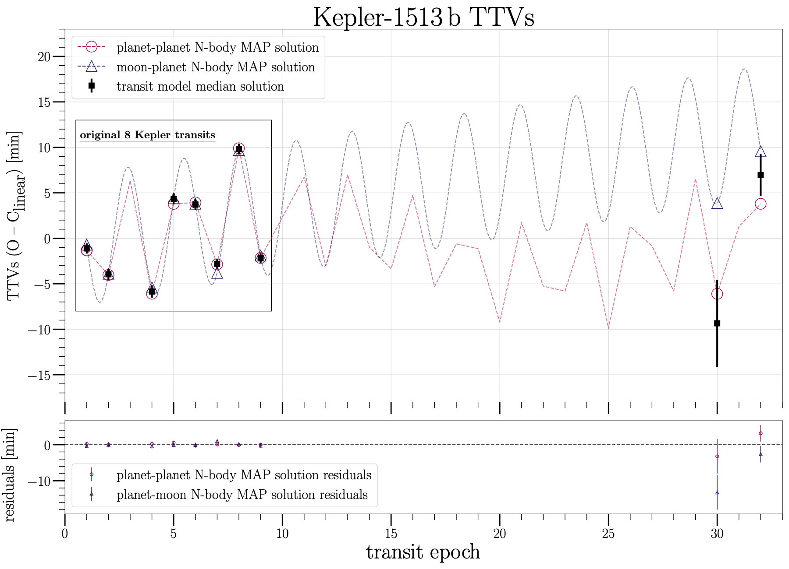
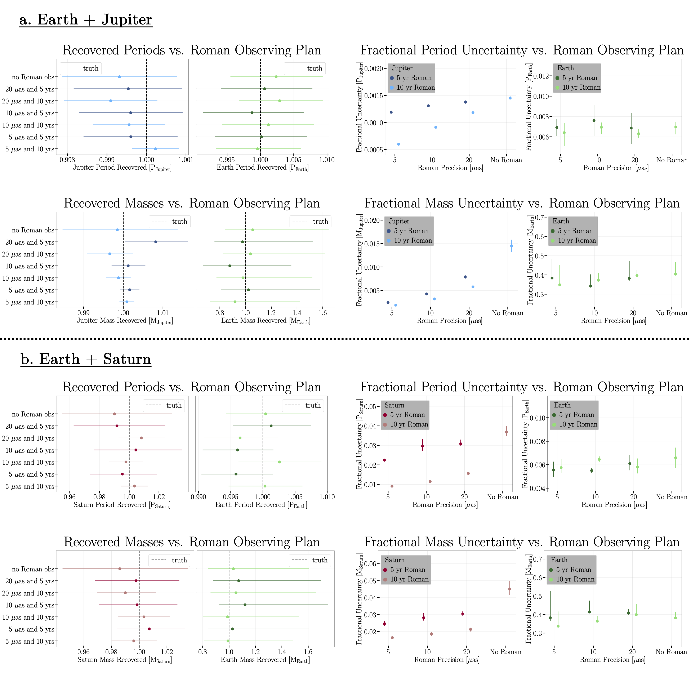
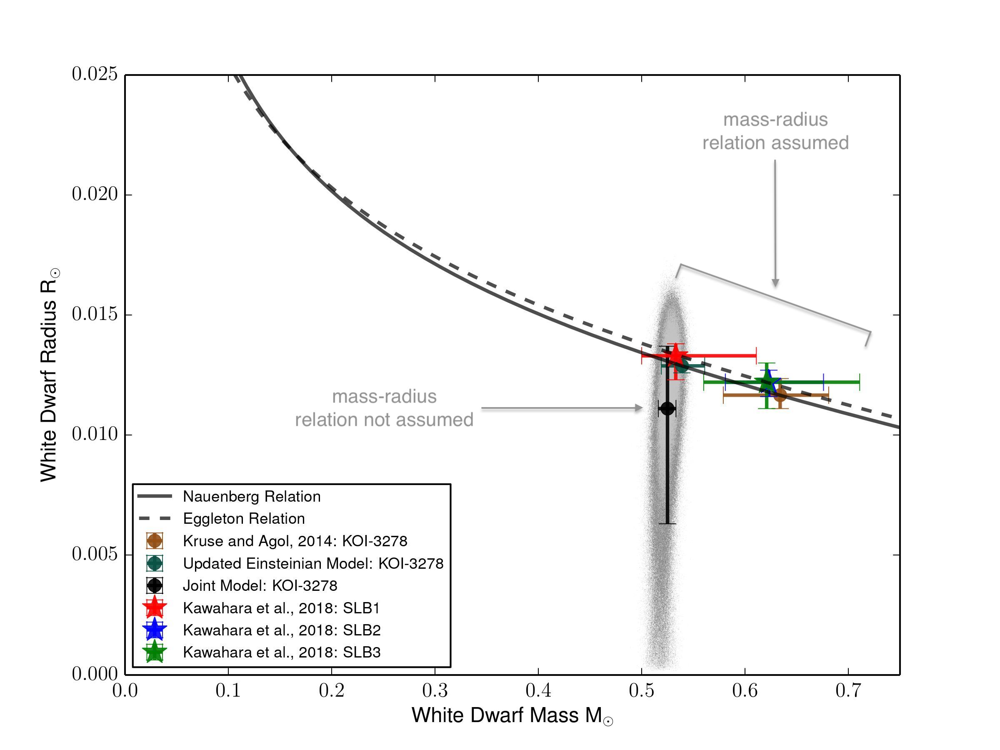
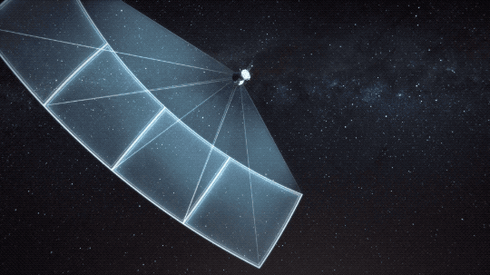
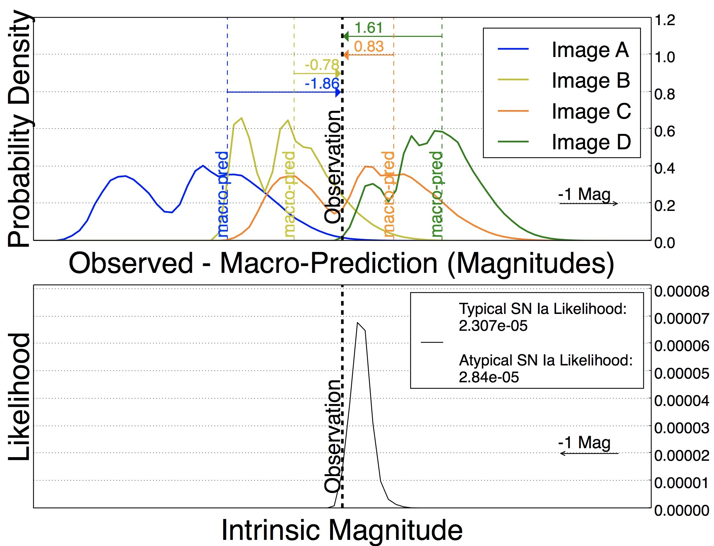



An up-to-date list of refereed publications can be found on [NASA/ADS](https://ui.adsabs.harvard.edu/search/filter_property_fq_property=AND&filter_property_fq_property=property%3A%22refereed%22&fq=%7B!type%3Daqp%20v%3D%24fq_property%7D&fq_property=(property%3A%22refereed%22)&q=%20author%3A%22yahalomi%2C%20daniel%22%20&sort=date%20desc%2C%20bibcode%20desc&p_=0). 

I've had the opportunity to work in a number of topics in astrophysics. I often say that my journey to exoplanet research started on the largest astrophysical scales and then slowly moved inward to smaller and less energetic phenomonema. I've lead original research in gravitational microlensing of strongly lensed supernova, self-lensing binary star systems in Kepler data and with ground-based radial velocity (RV) Doppler observations, simulating what the search for Solar System analogous planetary architectures will look like with next generation RV and astrometric surveys, and in model selection for exoplanet transit timing variations (TTVs).  

For a brief summary of these projects, see below:

## "Killing" the Moon Hypothesis in the Kepler-1513b System
_Advisor: [Prof. David Kipping](http://davidkipping.co.uk/)_  
_Paper: on [arXiv](https://arxiv.org/abs/2310.03802) // accepted in MNRAS (09/2023)_  
_Code: on [GitHub](https://github.com/dyahalomi/Kepler1513)_  
_Research Summary: [Twitter Thread](https://twitter.com/dyahalomi/status/1711408199025283218)_  

We performed model selection (planet-planet vs. planet-moon vs. stellar activity) on the TTVs observed in Kepler-1513b using follow-up ground-based and space (TESS) observations. We found that the complete TTV signal, including two additional transit observations, a ~decade since the last Kepler observation, was inconsistent with both the planet-moon and the stellar activity hypothesis and was consistent with an external perturbing non-transiting planet near the 5:1 mean motion reference (MMR).  

Using nested sampling with [MultiNest](https://github.com/JohannesBuchner/MultiNest), we modeled the TTVs with N-body simulations for the planet-planet model with [SWIFT](https://www.boulder.swri.edu/~hal/swift.html) and a photodynamical planet-moon model with [LUNA](https://arxiv.org/abs/1105.3499). We find that the planet-moon model is inconsistent with one the two new transit time observations at the ~3-σ level. We also show that the observed stellar activity (via stellar rotational period and slope of the LC around transits) is inconsistent with causing the observed TTVs. The main figure from this paper, showing this results, can be seen below. For more details, see the full [paper](LINK) and the [code](https://github.com/dyahalomi/Kepler1513).  

## Solar System Analog Hunting
_Advisors: [Prof. Ruth Angus](https://ruthangus.github.io/) & [Prof. David Spergel](https://www.astro.princeton.edu/~dns/)_  
_Paper: on [NASA/ADS](https://ui.adsabs.harvard.edu/abs/2023arXiv230205064Y/abstract) // under review at AAS Journals_ 
_Code: on [GitHub](https://github.com/dyahalomi/rv_and_astrometry)_  
_Research Summary: [Twitter Thread](https://twitter.com/dyahalomi/status/1625113519111675904)_  

Earth-mass exoplanets on year-long orbits and cool gas giants (CGG) on decade-long orbits lie at the edge of current detection limits. The Terra Hunting Experiment (THE) will take nightly radial velocity (RV) observations on HARPS3 of at least 40 bright nearby G and K dwarfs for 10 years, with a target 1σ measurement error of ~0.3 m/s, in search of exoplanets that are Earth-like in mass and temperature.  

However, RV observations can only provide minimum mass estimates, due to the mass-inclination degeneracy. Astrometric observations of these same stars, with sufficient precision, could break this degeneracy. Gaia will soon release ~100-200 astrometric observations of the THE stars with a 10 year baseline and ~34.2 μas 1σ along-scan measurement error.  The Nancy Grace Roman Space Telescope will be capable of precision astrometry using its wide field imager (target ~5-20 μas 1σ measurement error for bright stars) and could extend the astrometric observational baseline to ~25 years. We simulate and model an observing program that combines data from these three telescopes. 

We found that (1) THE RVs and Gaia astrometry can detect Earth-like and CGG-like exoplanets around bright Sun-like stars at 10 parsecs and that (2) adding Roman astrometry improves the detection precision for CGG masses and periods by a factor up to ~10 and ~4, respectively. Such a survey could provide insight into the prevalence of Solar System analogs, exoplanet architectures reminiscent of the mass and orbital separation hierarchy of our Solar System, for the nearest Sun-like stars.

## The Democratic Detrender
_Advisor: [Prof. David Kipping](http://davidkipping.co.uk/)_  
_Code: on [GitHub](https://github.com/dyahalomi/democratic_detrender)_  

I am the lead developer on an open source Python code package, called the `democratic_detrender`, that implements democratic (also previously called method marginalized) detrending. To summarize, democratic detrending uses several different detrending algorithms, and then takes the median solution between the detrending methods for each data point (and adds in quadrature to the errors the median absolute deviation between the detrending solutions). The code has been extensively tested (>1000 stars) on Kepler and TESS light curves  

In the package, we currently use four distinct detrending algorithms, which have each been shown in the literature to be efficient and accurate models for stellar noise: **CoFiAM**, **polyAM**, **local**, and **GP**. For a more detailed description of each detrending algorithm, see below and for a similar application see \citet{Kipping2022}:  
- **CoFiAM** or Cosine Filtering with Autocorrelation Minimisation builds on cosine filtering approach used to study CoRoT data (Mazeh & Faigler 2010). In CoFiAM, we train 30 models with N cosines in our fit, where N ranges from 1 to 30, and at each epoch pick the cosine filter that leads to the least correlated light curve via the Durbin- Watson statistic (Durbin & Watson 1950; Kipping et al. 2013).  
- **polyAM** or Polynomial detrending with Autocorrelation Min- imisation follows a similar process to CoFiAM, except we train 30 models with polynomial models as the basis function. Polynomial filtering is a common method for stellar activity detrending (Fab- rycky et al. 2012; Gautier et al. 2012; Giles et al. 2018). In polyAM, the 30 different bases models are 1st- to 30th-order polynomials. For each epoch, as above, the least correlated light curve via the Durbin- Watson statistic (Durbin & Watson 1950; Kipping et al. 2013) is chosen.  
- **local** method again uses 1st- to 30th order polynomials, but the local detrended light curve is selected via the lowest Bayesian Information Criterion (Schwarz 1978) computed on the data within six transit durations of the time of mid-transit. This a fairly typical detrending method for the analysis of short-period transiters (Sandford & Kipping 2017).
- **GP** or Gaussian process regression,as the name suggests, uses a Gaussian process to detrend the stellar activity. We used a quasiperiodic Gaussian process, as it has been shown that it is possible to model stellar activity of a rotating star using a quasiperiodic kernel (Angus et al. 2017). Specifically, we used a SHOTerm kernel from celerite2 via the exoplanet package, which is a stochastically-driven, damped harmonic oscillator (exoplanet, Foreman-Mackey et al. 2021), (celerite2, Foreman-Mackey et al. 2017; Foreman- Mackey 2018).  

A formal write-up, API documentation, and a tutorial for the `democratic_detrender` are forthcoming.

## Determining the Mass and Radius for the White Dwarf in KOI-3278
_Advisor: [Prof. David Latham](https://pweb.cfa.harvard.edu/people/david-latham)_  
_Paper: on [NASA/ADS](https://ui.adsabs.harvard.edu/abs/2019ApJ...880...33Y/abstract)_ // published in ApJ  
_Code: on [GitHub](https://github.com/dyahalomi/koi3278)_   

I also led a follow-up study of KOI-3278, the first discovered self-lensing binary (Kruse and Agol, 2014). In the paper, we presented independent Einsteinian and Newtonian gravitational models for the system and showed that the respective estimates for the white dwarf mass in KOI-3278 agreed within 5.2%. We also presented a joint Einsteinian and Newtonian model that allowed us to remove white dwarf evolution models and assumptions on the white dwarf mass-radius relation. Doing so provided a model independent test of the mass-radius relation and thus white dwarf structure models. ​​  

We are hopeful that further studies of the white dwarf in KOI-3278, as well as four other discovered white dwarf self-lensing systems, in conjunction with UV follow-up observations will provide a test of white dwarf structure models. I am currently working with Columbia Undergraduate student, Yassine Abaakil, on a project reproducing this work for the other four known Kepler self-lensing binaries.  

There was a press release for this paper, which can be found [here](https://www.cfa.harvard.edu/news/2019-16).

## Astronomer on the TESS Science Team

In between undergraduate and graduate school, I worked for two years as an astronomer at the Center for Astrophysics \| Harvard and Smithsonian (CfA) with Dr. David Latham. TESS, the Transiting Exoplanet Survey Satellite, is a NASA satellite that launched in April 2018. TESS searches for planets using the transit method. The transit method in exoplanet science is where we look for a periodic decrease in the light received from a distant star, due to the planet passing in front of the star relative to Earth. In working on TESS, I contributed to the science team in several ways and grew immensely as a researcher.​​  

**My work on the TESS Mission included:**  

- Group lead in the planet vetting process  -- for which I individually vetted light curves targeted as planet candidates by the analysis pipelines and led weekly group vetting sessions where we decided which targets to alert as planet candidates to the public.  

- I ran photometric follow-up observations (~20 nights) of TESS Objects of Interest (TOIs) using the 16” Clay Telescope at Harvard University to observe TOIs in the northern hemisphere. I also led outreach SG1 observing sessions (~10 nights) of TOIs with undergraduate students at the Clay Telescope as a part of the Harvard Observing Project.  

- I planned and ran spectroscopic follow-up observations of TOIs using TRES on the 1.5 m Tillinghast Reflector at FLWO on Mt. Hopkins, AZ.  

- I ran SPC analysis on TRES spectra of TESS planet candidate host stars to estimate the stellar temperature, metallicity, surface gravity, and rotation -- so that candidates for precise radial velocity observations by instruments like HARPS-N can be selected.

- I wrote an MCMC RV code, to help with the RV modeling of TRES spectroscopic observations.

## Gravitational Microlensing of the Strongly Lensed Type IA Supernova iPTF16geu
_Advisor: [Prof. Paul Schechter](https://space.mit.edu/people/schechter-paul-l/)_  
_Paper: on [NASA/ADS](https://ui.adsabs.harvard.edu/abs/2017arXiv171107919Y/abstract)_ // published in MIT Journal of Undergraduate Research  

As an undergraduate at MIT, I led an investigation into the micro-lensing of the first discovered, strongly lensed type Ia supernova, iPTF16geu. This system cause commotion when it was discovered, as its standard candle nature plus time delay values, could theoretically lead to a constraint of the Hubble parameter. However, the macro-models published by More et al. 2017 showed significant flux ratio anomolies with the observations of the four images. I constructed a Monte-Carlo simulation, in Python, which showed that the likelihood for micro-lensing to cause these flux ratio anomalies between observations and macro-models was ~3/1000. I then showed that even if the macro-models fit perfectly, the microlensing probability density functions create a probability distribution on the intrinsic brightness with a full width half maximum of 0.73 magnitudes. As such, the error for the standard candle brightness is quite large. This reduces the utility of the standard candle nature of type Ia supernovae. This project led to a first author paper, and cover article, in the MIT Undergraduate Research Journal Fall 2017, which has 30 academic citations (as of September 2023).  

I then built on this work, leading three other micro-lensing projects that took advantage of the code that I had generated, culminating in my senior thesis, entitled “Statistical Analyses of Gravitational Microlensing Probability Densities.”

